ADMLauncher
==========

### get administrator acces on every windows machines

# Introduction

_ADMLauncher_ est un script codé en **batch** et fournis avec les programmes d'installation _ADMUnlocker_ et _ADMsetup_. Ces scripts, permettent d'avoir les accès administrateurs sur n'importe quelle machine Windows.

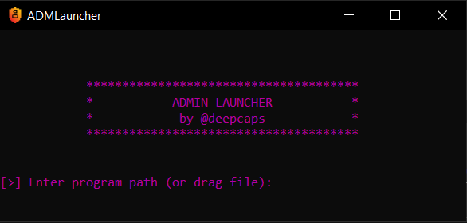

# Procédure

## Installation du fichier IMG
> Vous devez tout d'abord avoir téléchargé le repository sur une autre machine `git clone https://github.com/deepcaps/adm-launcher.git` et avoir une clée USB d'au moins **8 gigaoctets**

Pour commencer, installez le programme [**rufus**](https://rufus.ie/) (ou autre) pour graver le fichier ISO sur une clef USB.

Ensuite, gravez le fichier IMG sur la clef USB:
- "_Périphérique_" => Sélectionnez votre Périphérique USB
- "_Type de démarrage_" => Sélectionnez l'IMG du repository github
Enfin, cliquez sur "_DEMARRER_" pour lancer la procédure.

> Attention ! Tous les fichiers sur la clef seront supprimés !

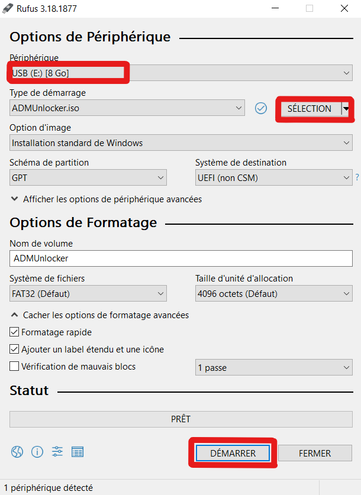

## Utilisation sur la machine cible

### Redémarrer en mode récupération
> Toutes les prochaines étapes sont à effectuer **sur la machine cible**.

Ouvrez les paramètres Windows, rendez vous dans "_Mise à jour et sécurité_" puis dans "_Récupération_"

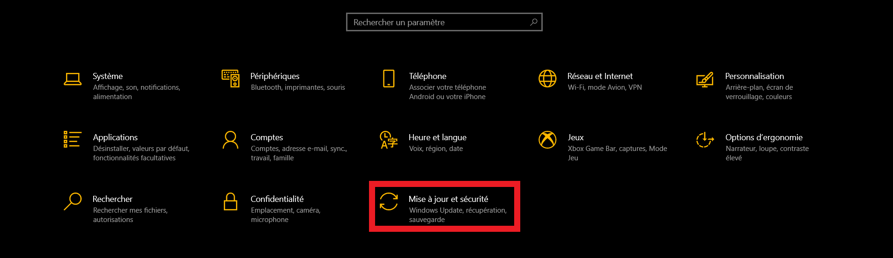

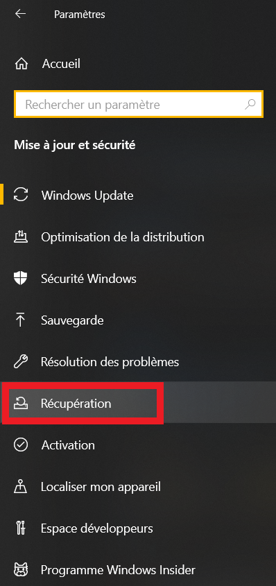

Pour finir, dans "_Démarrage avancé_", cliquez sur "**Redémarrer maintenant**":

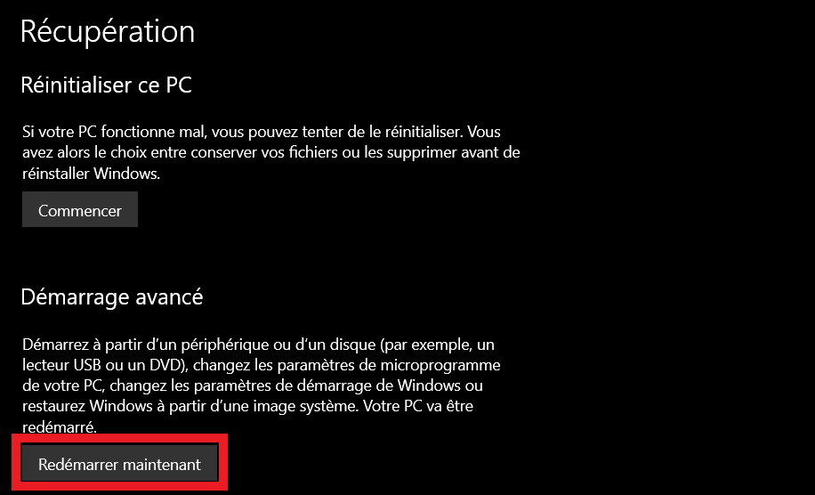

### Démarrer sur la clef USB
> Vous devez maintenant insérer la clef USB créée à l'étape précédente.

L'appareil devrait redémarrer puis afficher un écran bleu avec plusieurs options. Cliquez sur "_Utiliser un périphérique_".

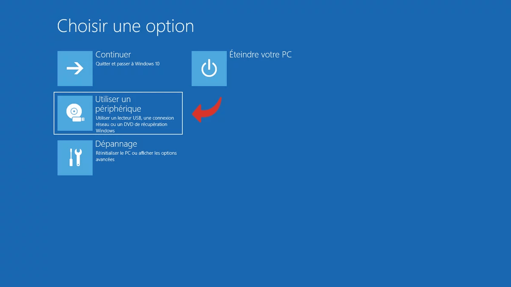

Cliquez ensuite sur "_EFI USB Device_"

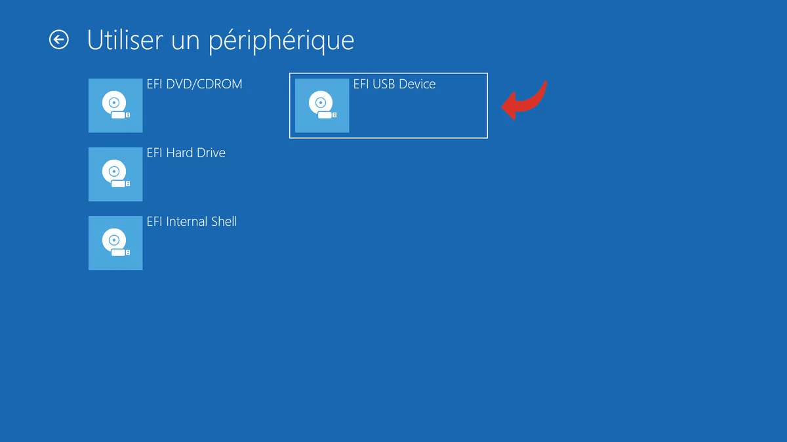

La machine devrait maintenant redémarrer sur la clef USB.

# Pre-setup

Choisissez votre disposition de clavier puis accédez à la ligne de commande en suivant ce chemin : _Dépannage_ > _Options avancées_ > _Command Prompt_

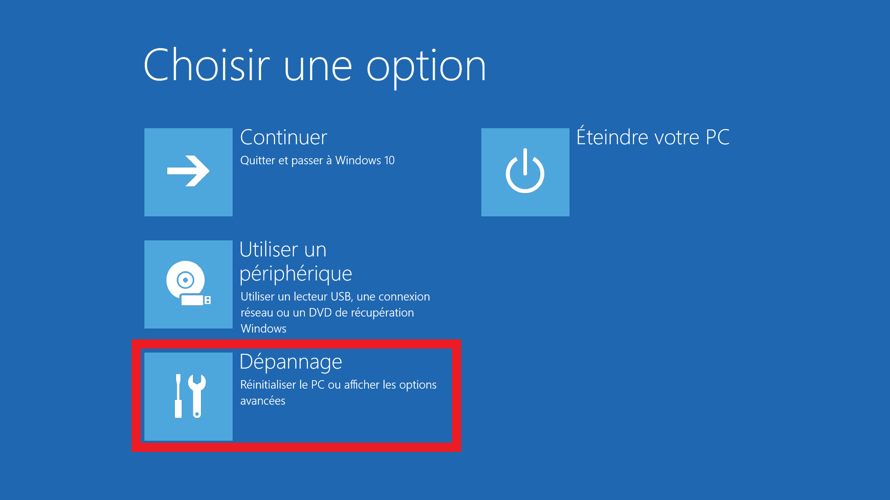

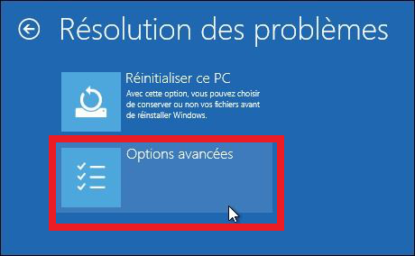

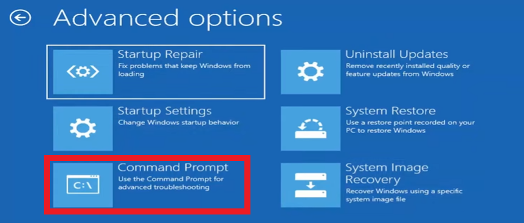

Vous avez maintenant accès à **la ligne de commande** !  
Pour localiser les fichiers sur la clef USB, entrez la commande `diskpart`

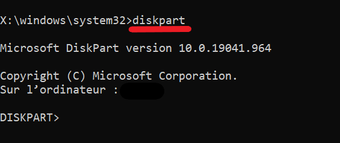

Entrez maintenant la commande `list vol`. Tous les volumes vont être affichés.  
Sélectionner celui qui correspond a votre clef USB (disque amovible) puis **retenez la lettre qui lui ai assignée** (ici "_G_")

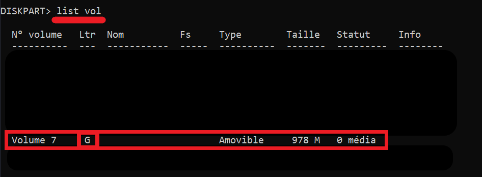

Quittez _diskpart_ avec `exit` puis executez **_ADMUnlocker_** en écrivant la commande suivante : `G:\ADMUnlocker.exe`
> **remplacez _G_ par la lettre de l'étape précédente**

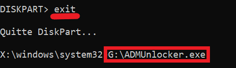

**ADMUnlocker** vous demande un mot de passe. Entrez [**_deepcaps_**](https://github.com/deepcaps/).  
Appuyez sur [ENTER] pour lancer le processus.

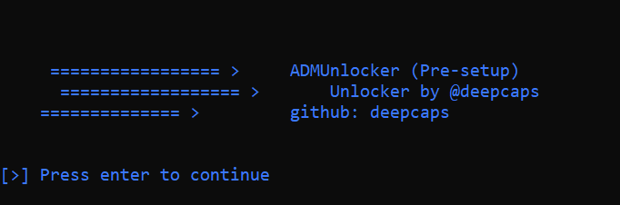

À la fin de ce dernier, appuyez encore une fois sûr [ENTER] pour quitter, puis pour revenir à Windows entrez la commande `exit` et appuyez sur "_Continuer_"

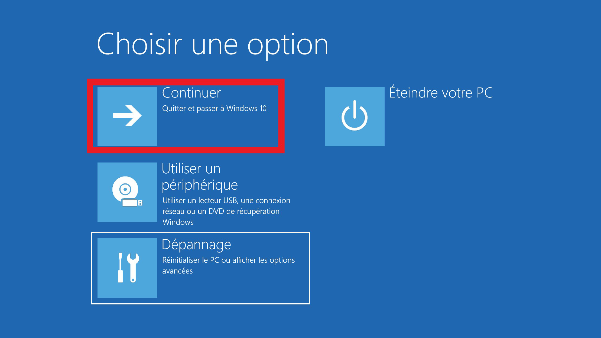

# Setup

De retour sur Windows, **NE VOUS CONNECTEZ PAS A VOTRE SESSION**. Appuyez 5 fois sur la touche [SHIFT].  
Une nouvelle _ligne de commande_ va s'ouvrir ! Entrez la commande `G:\ADMSetup.exe`
> **remplacez _G_ de votre clée USB**

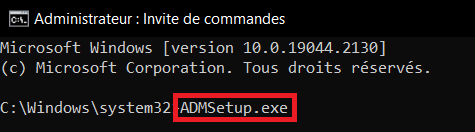

**ADMSetup** vous demande lui aussi un mot de passe. Entrez [**_deepcaps_**](https://github.com/deepcaps/) puis appuyez sur [ENTER] pour lancer le processus.  
Le programme vous demande maintenant le mot de passe pour le compte : entrez en un et **ne l'oubliez pas**, ce sera le mot de passe qui servira pour le **ADMLauncher**.
> Ne laissez surtout pas le champ vide !

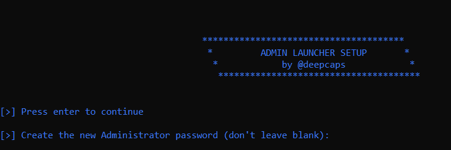

À la fin du processus, appuyez sur [ENTER] pour continuer et, enfin, sur _[y]_ pour redémarrer la machine et appliquer les modifications.

**FELICITATION !!** _ADMLauncher_ est maintenant installé. **Vous êtes administrateur** !

# Guide d'utilisation

## Mode manuel

Pour lancer le **ADMLauncher** de façon manuelle, il existe plusieurs façons:
- Par le raccourci sur le _bureau_
- Par le raccourci dans le _menu démarrer_
- Dans la _ligne de commande_ ou dans la _fenêtre "executer"_ (WIN + R) en entrant la commande `ADMLauncher`

La fenêtre suivante s'ouvrira:

Vous devrez donc entrer le chemin d'un programme que vous voulez lancer en **Administrateur** ou le _glisser-déposer_
> Exemple: _C:\Windows\system32\cmd.exe_ (pour lancer une _invite de commande_)

**ADMLauncher** vous demandera le _mot de passe Administrateur_ (mot de passe que vous avez créé durant l'installation).

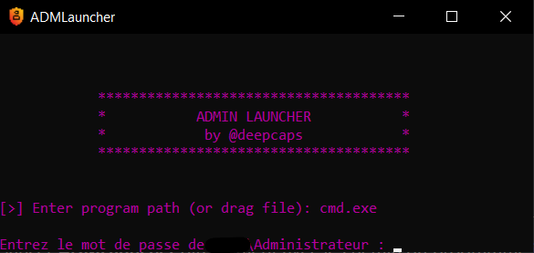

Une fois cela fait, le programme se lance.

## Mode automatique

Il existe toutefois, une façon de lancer **ADMLauncher** directement avec le chemin du programme inscrit.  
Pour cela: _clique droit_ > _Open in ADM mode_  

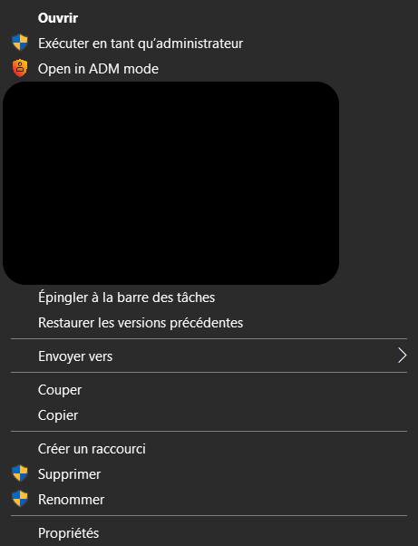

Il ne vous restera plus qu'à entrer le _mot de passe Administrateur_ et votre programme se lancera.

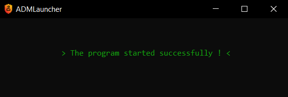

# Me contacter
Vous pouvez me contacter à l'adresse [**deepcaps@outlook.com**](deepcaps@outlook.com) pour me faire parvenir les bugs ou les fonctionnalités à rajouter.

# Infos

